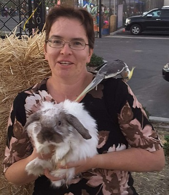
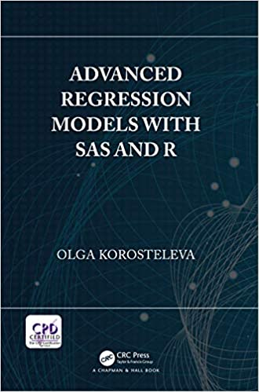

```{r setup, include=FALSE}
options(htmltools.dir.version = FALSE)
knitr::opts_chunk$set(echo = FALSE)
```

# Orange County R User Group

.col-left-wide[
* Email:  
  orangecounty.rug@gmail.com
* Website:  
  https://www.meetup.com/OC-RUG/  
  https://ocrug.org
* GitHub Repo:  
  https://tinyurl.com/ocrug-github
* YouTube:  
  https://tinyurl.com/ocrug-youtube 
* Slack:  
  https://tinyurl.com/socalrug-slack
* Slack Signup:  
  https://tinyurl.com/socalrug-slack-signup
* Twitter (@oc_rug)  
  https://tinyurl.com/ocrug-twitter 
* Linkedin:  
  https://www.linkedin.com/company/ocrug/
]

.col-right-narrow[
```{r}
knitr::include_graphics('logo_ocrug_blue_grey.svg')
```
]

---

# Sponsor

```{r}
knitr::include_graphics('UCI_Merage_Business_School.jpg')
```

.large[
<br/>
<br/>
<div style="text-align: center">https://merage.uci.edu/</div>
]

---

# Logistics

.large[
* Mute your mic
* Turn your camera on during the exercise portion
]

---

# Logistics - Plan of Record

.large[
* Two 40-min sessions (one  per regression)
* Break
* Two 40-min sessions
]

---

# Logistics - Session Format

.large[
1. Theory
1. Example problem
1. Exercise problem
  1. Work in groups via breakout rooms
1. Go over the solution
]

---

# Logistics - Communication

.col-left-wide[
.medium[
* Contacting the organizers
  * Slack: **#regression-2020** channel
  * Zoom chat (harder to chat)
* Organizers
  * Ryan Benz
  * John Peach
  * Pablo Barajas
* Github README
  * https://github.com/ocrug/  
  repo: regression_models_2020-10-13
]]

.col-right-narrow[
```{r, out.height=125}

```
</br>Ryan Benz

```{r, out.height=125}

```
</br>John Peach

```{r, out.height=125}

```
</br>Pablo Barajas
]

---

# Logistics - Tools

.large[
* RStudio Cloud
  * https://rstudio.cloud/project/1683550
* Personal computer
  * Install the package: rcompanion
]

---

# About Dr. Olga

.col-left-wide[
.medium[
* Ph.D. in Statistics from Purdue University
* Professor of Statistics at CSU Long Beach
* Teaches Statistics courses mostly in the Master's program in Applied Statistics
* Past-president of the Southern California Chapter of the American Statistical Assocation
* Has authored four books on statistics
]]

.col-right-narrow[
```{r}

```
]

---

# About the Book

.col-left-wide[
## Advanced Regression Models With SAS and R

.large[
* Course is based on the book
* PDF copy of the book and solution manual in Github repo
  **please do not share**
* Buy it on [Amazon](https://www.amazon.com/dp/B07L1B143S/)
]]

.col-right-narrow[
```{r}

```
]
